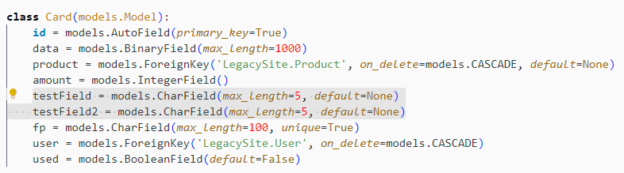
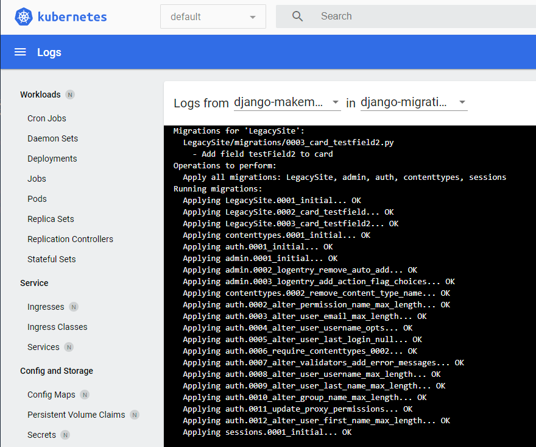
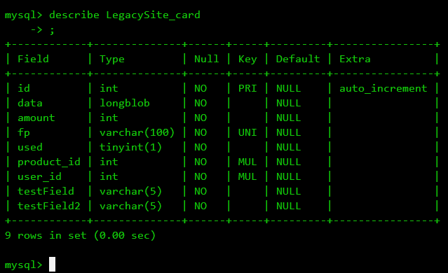
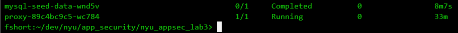
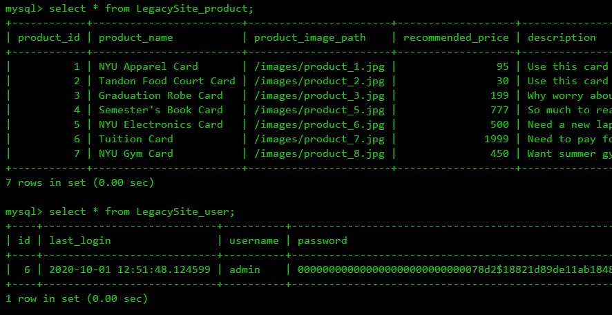

# Part 2 - Applying Migrations
## Summary
For this part of the lab, I created two separate kubernetes jobs - one to perform the django migrations and one to seed the database after the migrations were applied. To start, I commented out the following line in the <code>/db/Dockerfile</code>:
```
#COPY ./setup.sql /docker-entrypoint-initdb.d/setup.sql
```
Once this was commented out, I rebuilt and redeployed the database container. The result is the database initializes without any schema defined (and obviously, no data). At this point, I applied these 2 jobs:

## db-migrations.yaml
To test this, I added 2 additional fields to the Cards model:


I created the k8 job with the following command:
```
kubectl apply -f db-migrations.yaml
```

The job executed and viewing the pod logs show:



<br>I confirmed the schema was applied with the 2 fields (testField, testField2) added to the model by getting a remote session in the db pod and checking its schema:



<br>

## db-seed.yaml
For seeding, my approach was to use the same sql currently used in the setup.sql file and import that using the mysql command line interface to execute the sql. <br><br>First, I extracted the <code>'LOAD DATA'</code> sql defined in the original setup.sql file and put this into a separate <code>/db/seed.sql</code> file. This contains:
```
USE GiftcardSiteDB

--
-- Put product into table
--
LOAD DATA INFILE '/data/products.csv' INTO TABLE LegacySite_product FIELDS TERMINATED BY ',' OPTIONALLY ENCLOSED BY '\"' LINES TERMINATED BY '\r\n';
--
-- Put user into table.
--
LOAD DATA INFILE '/data/users.csv' INTO TABLE LegacySite_user FIELDS TERMINATED BY ',' OPTIONALLY ENCLOSED BY '\"' LINES TERMINATED BY '\r\n';
```
Next, I added this line to the <code>/Dockerfile</code> to copy the sql file to the /data directory in the pod so its available when the job runs:

```
COPY /db/seed.sql /seed.sql
```

Last, I defined the <code>db-seed.yaml</code> job to execute the command to import the data using the mysql command-line client, running from the django app container. Key to get this to work was to pass the -h and --protocol options, otherise the client wouldn't connect:
```
name: mysql-seed-data
    image: nyuappsec/assign3:v0
    command: ["/bin/sh", "-c"]
    args: ["mysql -h $MYSQL_HOST --protocol=TCP -uroot -p$MYSQL_ROOT_PASSWORD < /seed.sql"]
    env:
    - name: MYSQL_ROOT_PASSWORD
        valueFrom:
        secretKeyRef: 
            name: mysql-root-secret
            key: password

    - name: MYSQL_DATABASE
        value: GiftcardSiteDB

    - name: MYSQL_HOST
        value: mysql-service
    ports:
    - containerPort: 3306
    volumeMounts:
    - name: mysql-volume-mount
        mountPath: /var/lib/mysql
volumes:
- name: mysql-volume-mount
    persistentVolumeClaim:
    claimName: mysql-pvc
```

When the job runs, the command passes in the seed.sql content to the mysql client. Since the sql is executing on the mysql server, the file references in the sql statements need to point at the file locations local to the server, in this case the files in the /data directory. These were added when the db contatiner was created.



To conclude, I confirmed the tables were populated after the job ran:

