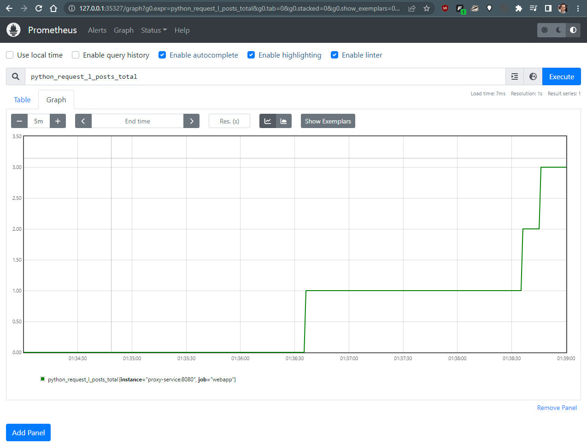

# Part 3 - Prometheus Monitoring
## Initial Setup 
This addresses <b>Part 3.3</b> but am listing here first:
1. Started by installing helm package manager following documentation <a href="https://helm.sh/docs/intro/install/">here</a>. 
2. Once this was installed, used helm to install prometheus service into the cluster following the directions <a href="https://artifacthub.io/packages/helm/prometheus-community/prometheus">here</a>.
    ```
    helm install monitor prometheus-community/prometheus
    ```
3. Added the config that allows prometheus to scrape the metrics from the application. Did that by adding the following to the <code>monitor-prometheus-server</code> configmap:
    ```
    kubectl edit configmap monitor-prometheus-server
    ```
    then added:
    ```
    - job_name: webapp
        scrape_interval: 10s
        static_configs:
        - targets:
          - proxy-service:8080
    ```
I exported the full <code>monitor-prometheus-server</code> config in <code>./prometheus.yaml</code>.

## Changes in views.py
- <b>Part 3.1</b>: Removed (commented out) the following lines from the register_view function:
    ```
    if pword not in graphs.keys():
        graphs[pword] = Counter(f'counter_{pword}', 'The total number of times {pword} was used')
        graphs[pword].inc()
    ```

- <b>Part 3.2</b>: Added the <code>database_error_return_404</code> config definition
    ```
    graphs['404_counter'] = Counter('database_error_return_404', 'The total number of 404 requests.')
    ```

    Searched the code for each area where it returns an HTTP 404 (HttpResponse() contains 404 in text) and incremented the 404 counter.
    ```
    graphs['404_counter'].inc()
    ```

## Redeploy
Once the code was changed, I rebuilt and redeployed the entire setup:
```
eval $(minikube docker-env)

docker build -t nyuappsec/assign3:v0 .
docker build -t nyuappsec/assign3-proxy:v0 proxy/
docker build -t nyuappsec/assign3-db:v0 db/

kubectl apply -f db/k8
kubectl apply -f GiftcardSite/k8
kubectl apply -f proxy/k8
```

## Prometheus Dashboard
Once everything was redeployed I ran the following command to get to the prometheus dashboard to see the metrics being collected:
```
minikube service monitor-prometheus-server
```
This launched the dashboard in my browser and after similating some activity in the web app, I can see metrics being collected (this shows a few login attempts):
